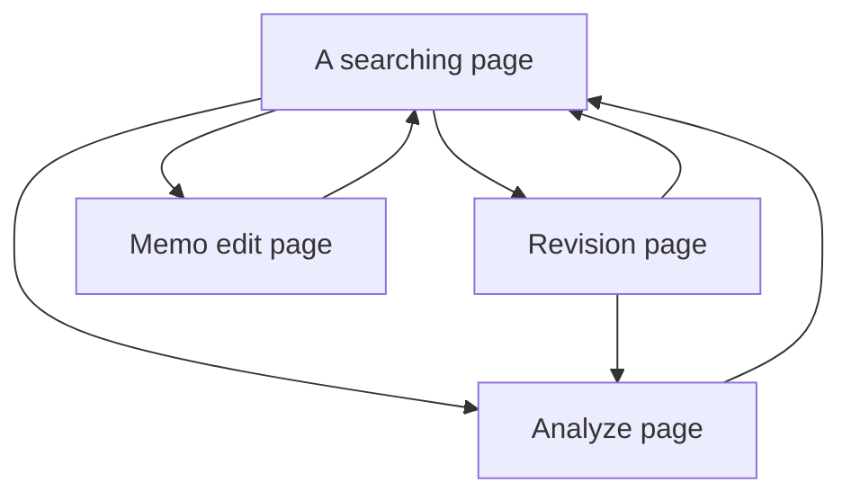
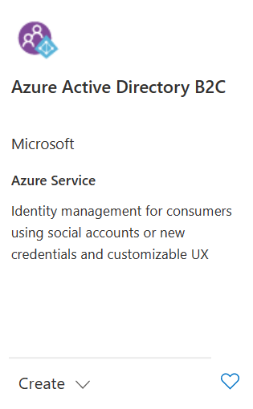

<div align="center">

# Endure

Production brings more laziness. Laziness?... 

</div>

## Design

Page design and logic:



## Description

The main purpose of this program is to overcome my laziness in memorizing words.
It will provide 

# Procedure


### Step 1:

Login your account:
```shell
az login
```

Create the resource group:
```shell
az group create -l northeurope -g Projects
```

Deploy web api by azuredeploy.json, we explode 6 parameters:

- `--projectName` could setup the service name based on it.
- `--sqlAdministratorLogin` could setup the database name.
- `--sqlPassword` could setup database password.
- etc.,

```shell
az deployment group create -g Projects --template-file azuredeploy.json --parameters sqlPassword=App1Complex2Password34
```

### Step 2:

Enable Azure B2C Resource:

