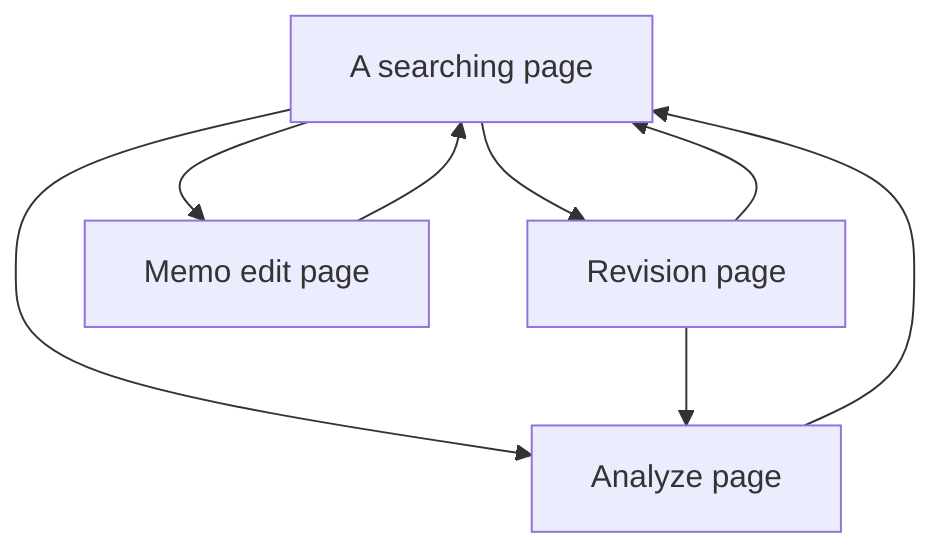

<div align="center">

# Endure

Production brings more laziness. Laziness?... 

</div>

## Design

Page design and logic:



## Description

The main purpose of this program is to overcome my laziness in memorizing words.
It will provide 

# Procedure


### Step 1: Register resources to azure by CLI

1. Login your account with valid subscription
```shell
az login
```

2. Create the resource group
```shell
az group create -l northeurope -g Projects
```

3. Deploy web api by `azuredeploy.json`, we explode 6 parameters
- `--projectName` could setup the service name based on it.
- `--sqlAdministratorLogin` could setup the database name.
- `--sqlPassword` could setup database password.
- etc.,
```shell
az deployment group create -g Projects --template-file azuredeploy.json --parameters sqlPassword=App1Complex2Password34
```

In addition, we could check user information by command below
```shell
az deployment group show -g Projects -n azuredeploy --query properties.outputs
```

### Step 2: Register authentication feature

1. Enable Azure B2C Resource:

2. Create B2C Tenant by gui guidance, and register app under B2C Tenant directory.
    - it will bind subscription automatically to target directory.

3. Follow the advices under `Integration assistant`


4. Add user flows under `Policies > User flows`


5. Now could collect information from `Azure portal`
```json
{
   "AzureAdB2C": {
      "Instance": "[Enter the instance url of your B2C tenant, e.g. https://noendure.b2clogin.com]",
      "TenantId": "[Enter 'common', or 'organizations' or the Tenant Id (Obtained from the Azure portal. Select 'Endpoints' from the 'App registrations' blade and use the GUID in any of the URLs), e.g. 59a5b817-8ff1-47cb-a17e-2b29730b548a]",
      "ClientId": "[Enter the Client Id of the service (Application ID obtained from the Azure portal), e.g. 73d8319f-92d8-43a1-93aa-92993d3e7298]",
      "Domain": "[Enter the domain of your B2C tenant, e.g. noendure.onmicrosoft.com]",
      "SignUpSignInPolicyId": "b2c_1_susi",
      "ResetPasswordPolicyId": "b2c_1_reset",
      "EditProfilePolicyId": "b2c_1_edit_profile"
   }
}
```
